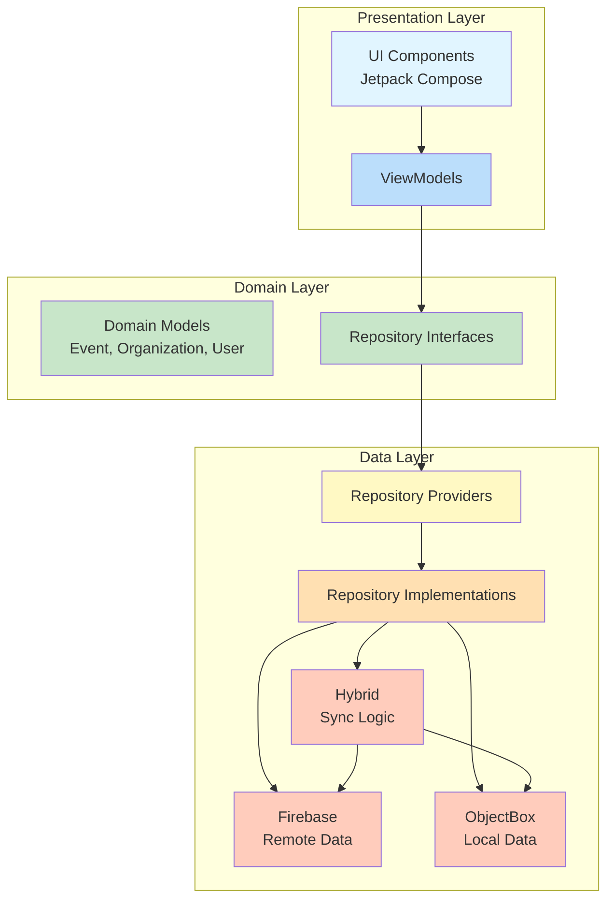
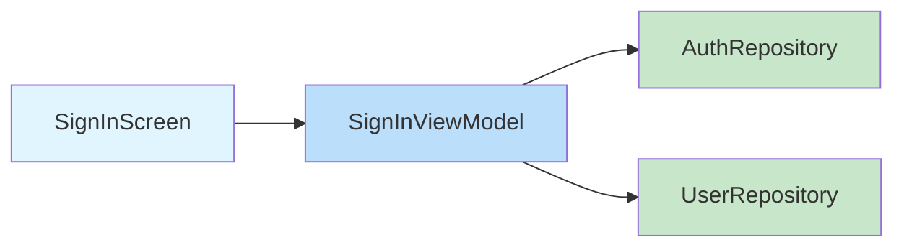
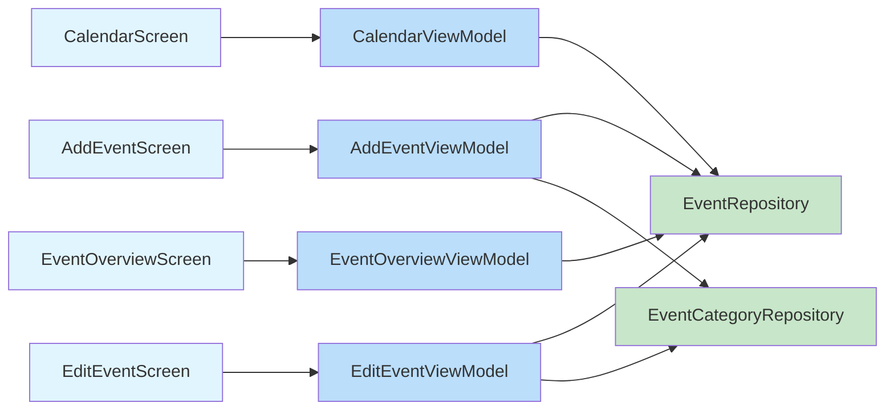
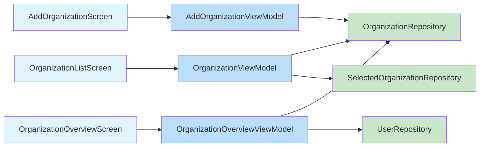
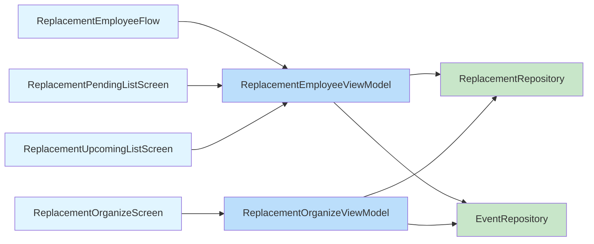
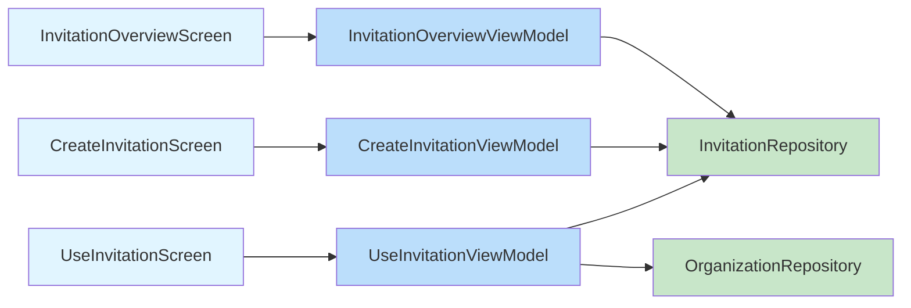
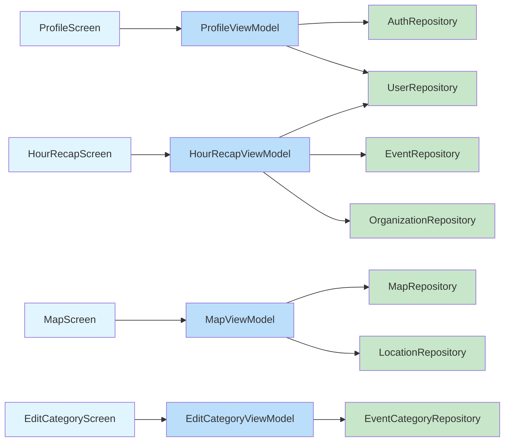
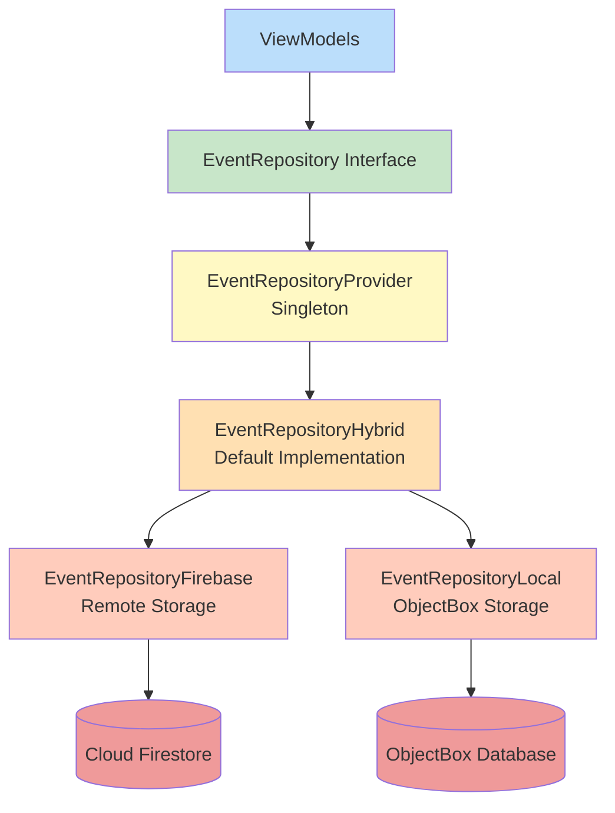
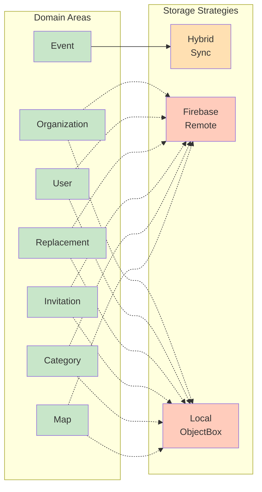

# Agendapp Architecture

Android application for managing organizational calendars, events, employee schedules, and replacements using **Clean Architecture** + **MVVM** + **Jetpack Compose**.

---

## Layered Architecture



---

## Complete Data Flow: Screens → ViewModels → Repositories

````carousel
<!-- slide -->
### Authentication Flow



<!-- slide -->
### Calendar & Events Flow



<!-- slide -->
### Organization Flow



<!-- slide -->
### Replacement Flow



<!-- slide -->
### Invitation Flow



<!-- slide -->
### Profile, Settings & Utilities Flow


````

---

## Data Layer Architecture

### Event Repository Pattern



### Storage Strategies by Domain




